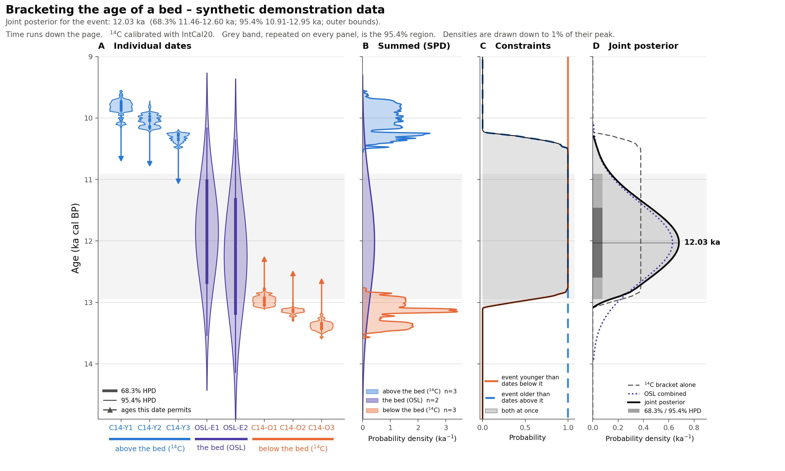

# Bracketing the age of a bed

A small, self-contained demonstration of how to combine three kinds of
geochronological constraint on one event, and how to draw the result with time
running down the page.

Everything here runs on **synthetic data**. No real sample is described in this
folder.



## The three categories

Every date in a bracketing problem does one of three jobs. This code names them
by *direction*, because the conventional names are the thing everyone inverts:

| category | where the sample sits | what it says | conventional name |
|---|---|---|---|
| `older_limiting` | below the bed | the event is **younger** than this | maximum-limiting age |
| `event` | the bed itself | this **is** the age of the event | — |
| `younger_limiting` | above the bed | the event is **older** than this | minimum-limiting age |

## The demonstration data

Eight synthetic dates, in `synthetic_ages.csv`:

- three ¹⁴C ages below the bed, calibrating to **≈13 ka** (11,040–11,510 ¹⁴C yr BP,
  ±55–70 yr — ordinary AMS precision at that age);
- two quartz OSL ages on the bed itself at **≈12 ka** (11,850 ± 850 and
  12,250 ± 950 yr, i.e. 7–8% 1σ — typical total uncertainty for a well-behaved
  luminescence age);
- three ¹⁴C ages above the bed, calibrating to **≈10 ka** (8,795–9,150 ¹⁴C yr BP,
  ±40–50 yr).

The ¹⁴C determinations were chosen by reading IntCal20 backwards from the target
calendar ages, so their calibrated distributions really do land where intended —
and really do carry the skew and multi-modality the calibration curve imposes.

**Which number goes where is fixed by the stratigraphy, not by the naming.** A
*maximum-limiting* age is the older one — it sits below the bed and caps how old
the event can be — and a *minimum-limiting* age is the younger one, above. The
two names are easy to swap by accident, and swapping them here would put the
older dates above the younger ones. Hence 13 ka below, 12 ka for the bed, 10 ka
above, and hence the direction-first category names in the table earlier.

Swap the `category` values in the CSV and rerun to see what an inverted bracket
does. The code detects it and refuses, by name:

```
ValueError: the limiting ages leave no permitted age for the event: the material
below the bed dates to ~9813 cal BP or younger, while the material above dates to
~13383 cal BP or older. Either the stratigraphic assignments are swapped, or the
dates and the stratigraphy genuinely disagree.
```

That is the correct answer to an inverted bracket under this model: no age
satisfies both bounds, so the posterior has no mass anywhere. Real inverted
brackets do happen, and they are informative when they do — but reading one needs
a model that admits the stratigraphic assignment or a date might be wrong, rather
than a product of hard constraints that can only return "impossible".

## What gets computed

Each date becomes a probability density on a common 1-year calendar grid: ¹⁴C by
IntCal20 calibration (via `iosacal`), OSL as a Gaussian. Then, with θ the true
age of the event and a uniform prior:

```
posterior(θ)  ∝  ∏ᵢ Sᵢ(θ) · ∏ⱼ Fⱼ(θ) · ∏ₖ pₖ(θ)

  Sᵢ(θ) = P(tᵢ > θ) = 1 − CDFᵢ(θ)      dates below the bed
  Fⱼ(θ) = P(tⱼ < θ) =     CDFⱼ(θ)      dates above the bed
  pₖ(θ)                                 dates on the bed
```

That is a **product**, not a sum — the distinction the figure is built around:

- A **summed probability density** (panel B) pools dates that need not share an
  age. It answers *when was there dating activity?*
- The **joint posterior** (panel D) answers *when did this one event happen,
  given that every date speaks to it?* It is always sharper than its inputs.

For the demonstration data:

| | mode | 68.3% | 95.4% |
|---|---|---|---|
| ¹⁴C bracket alone | 10.65 ka | 10.65–12.74 ka | 10.37–12.91 ka |
| OSL combined | 12.03 ka | 11.39–12.66 ka | 10.76–13.29 ka |
| **joint posterior** | **12.03 ka** | **11.46–12.60 ka** | **10.91–12.95 ka** |

The bracket alone is a broad plateau: three tight ¹⁴C ages on either side pin the
*edges* and say nothing about the interior. The OSL locates the event but is
imprecise. Together, the limiting ages trim the OSL's old tail — 13.29 → 12.95 ka
at 95.4% — because the material beneath the bed forbids it. The younger bound
barely bites here; that asymmetry is the honest result of this particular
geometry, not a defect.

## The figure

Four panels on one shared vertical age axis, **young at the top, old at the
bottom**, so the figure reads like a core: material above the bed plots above it.

- **A — Individual dates.** Each date's full density, drawn sideways in its own
  slot, with 68.3% and 95.4% HPD spines. Arrows point into the ages each limiting
  date permits. Each density is scaled to the same peak width; precision is read
  off the *vertical* extent, which is shared, so a tight ¹⁴C date is a thin band
  and a 7% OSL age is a fat one.
- **B — Summed (SPD).** The per-category SPD. Pooling, not combining.
- **C — Constraints.** The limiting-age constraint functions, on [0, 1]. They get
  their own panel because they are probabilities, not densities, and forcing them
  onto a density axis would mean a second scale.
- **D — Joint posterior.** The product, against the two things it is built from.

The grey band repeated across every panel is the posterior's 95.4% region.
Densities are drawn down to 1% of their peak (≈±3σ for a Gaussian); the tails
continue below that. Figure annotations give HPD **outer bounds**; the printed
table and `format_hpd()` give every disjoint sub-interval, which for calibrated
¹⁴C is genuinely ragged.

## Assumptions the product hides

Worth reading before pointing this at real data:

1. **The event has one true age.** Multiplying the two OSL likelihoods assumes
   both date the same depositional moment, with no unmodelled scatter — no
   partial bleaching, no post-depositional mixing, no overdispersion. If the ages
   disagree by more than their errors allow, the product is a lie, and what you
   want is a scatter term.
2. **The stratigraphy is right.** Everything in `older_limiting` really is below,
   everything in `younger_limiting` really is above.
3. **The dates are independent.**
4. **The prior on θ is uniform.**

One real-world caveat the demo glosses: OSL ages are reported relative to the
year of sampling, not AD 1950. Here they are treated as cal yr BP directly, which
costs a few decades — negligible at 12 ka, and worth correcting for a Holocene or
historical target.

## Running it

```
pip install -r requirements.txt
python plot_age_brackets.py     # writes age_brackets.png / .pdf, prints the numbers
python test_agedist.py          # checks; also runs under pytest
```

## Files

| file | what it is |
|---|---|
| `agedist.py` | the mathematics — calibration, densities, constraints, posterior, HPD. No plotting. |
| `plot_age_brackets.py` | the figure. |
| `test_agedist.py` | checks, including two that catch an inverted limiting-age constraint — the one error here that still produces a smooth, plausible-looking posterior. |
| `synthetic_ages.csv` | the eight synthetic dates. Edit this to try other geometries. |
| `age_brackets.png` / `.pdf` | the output. |

## Trying your own numbers

Edit `synthetic_ages.csv`. `method` is `14C` (age in conventional ¹⁴C yr BP,
error the laboratory 1σ) or `OSL` (age and 1σ already in calendar years).
`category` is one of the three above. Nothing else needs to change — the panels,
the constraint products, and the axis range all follow from the table.

## License

GNU General Public License v3 – see [LICENSE](LICENSE).
